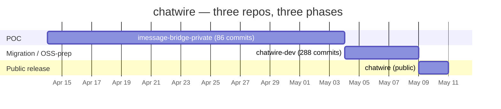
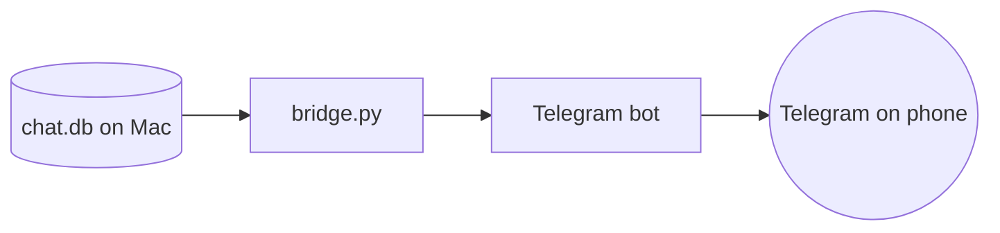
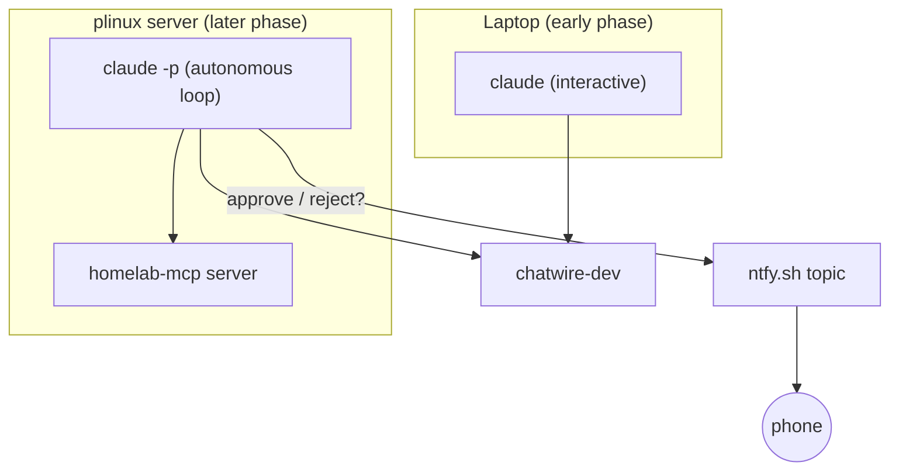

# How chatwire was built

> *Three repos, a subscription upgrade, and a slow handoff from babysitting a terminal to running a finely-oiled machine.*

This is the long version of what's on the [landing page](https://allenbina.github.io/chatwire/). If you're a journalist, a curious dev, or someone considering a similar build, the timeline is here in numbers and dates — not vibes.

## The setup

I'm a data and platform engineer, twenty years in, mostly day-job work in Informatica, Databricks, and Ansible-driven infrastructure on Azure. I run a homelab — a k3s cluster on HP EliteDesk mini PCs, GitOps with Argo CD, the usual self-hoster sprawl — but I'm not primarily a Python developer, and I'd never shipped a public, production-quality piece of macOS software.

For most of this project, the actual development hardware was a Lenovo Yoga and a 4 GB RAM, 720p, 11-inch Acer netbook. New laptop only landed about six months ago. The hardware mattered less than I'd have guessed before starting.

The pair programmer throughout: Anthropic's Claude.

## Three repos

| Repo | Visibility | Range | Commits | Purpose |
|------|-----------|-------|--------:|---------|
| `imessage-bridge-private` | private | Apr 14 → May 4 | 86 | proof-of-concept, "does this even work" |
| `chatwire-dev` | private | May 4 → present | 288 | active dev: rebrand, plugin architecture, autonomy build-out, UI rewrite |
| `chatwire` | public | May 9 → today | 3 | the published face — release-quality snapshots only |

A combined ~377 commits on the dev side, three weeks calendar-time, one person.

## Phase 1 — POC. April 14 → May 4. (`imessage-bridge-private`, 86 commits)

The first commit was a single Python file calling Apple's `imessage` AppleScript bridge plus a helper that watched `chat.db`. The goal was self-checking: could I read my own iMessages from somewhere that wasn't my Mac?

What landed in this phase:

- bridge.py + chat_db reader + iMessage send wrapper (`Initial scaffold` commit, Apr 14)
- A pmset bundle so the Mac wouldn't sleep mid-relay
- Python 3.12 requirement notes, secrets loaded from `~/.imessage-tg/.env`
- A whitelist + prefix system so chats could be selectively bridged
- The first Telegram integration

I was on **Claude Pro ($20/month)** for this phase. The dev rhythm was: write a turn, wait for tokens to refresh, write another turn. Babysitting.

The phase ended with a "depersonalization sweep" — `oss-prep: depersonalize docs — new README, reference install moved + scrubbed` (May 4) — once it was clear the thing actually worked and could be cleaned up for public release.

## Phase 2 — The OSS pivot and the subscription upgrade. May 4.

Two things happened on May 4 in close sequence:

1. The OSS-prep work in the POC repo wrapped, and a new repo — `chatwire-dev` — was spun up as the new private dev surface. The old repo got archived in spirit, kept around for history.
2. **I upgraded from Claude Pro ($20) to Claude Max ($100).** Reason: I was tired of waiting for tokens to refresh. The throughput delta was the inflection point of the whole project.

This is the single biggest lesson from the build: **the marginal cost of more Claude tokens is dramatically lower than the marginal cost of waiting for them.** Once I stopped throttling, the project's velocity changed shape.

> "Went from babysitting a terminal to running a finely-oiled machine."

## Phase 3 — Autonomy build-out. May 5 → May 9. (`chatwire-dev`, 288 commits)

This phase is where chatwire stopped being a single-user iMessage relay and started being a small open-source product. Most of the architectural decisions that distinguish chatwire from BlueBubbles or AirMessage were made here.

### 3a. ntfy plugin (May 7)

The first plugin to land outside Telegram was ntfy. The plumbing was reused from another project I had — my homelab already used ntfy for infrastructure alerts, so the integration code was largely a port, not a fresh build. This is when chatwire started being plugin-shaped instead of a Telegram-specific bridge.

> Commit: `docs(handoff): ntfy sent to Allen; PyPI publisher still pending` (May 7)

### 3b. MCP integration (May 8)

Added an MCP (Model Context Protocol) plugin that exposes chatwire as a stdio MCP tool. This means a Claude conversation can now read and send iMessages directly through chatwire, without the user shelling commands.

> Commit: `feat(mcp): add MCP integration — expose chatwire as stdio MCP tools` (May 8)

This connected to my existing **homelab-mcp** server (live at `mcp.allenbina.uk`, exposed via Cloudflare Tunnel + OAuth) — chatwire became one of the things that server can answer questions about.

### 3c. Laptop → server handoff (May 5 → May 7)

Started May 5 with the `overnight-claude` project — a small wrapper for running headless `claude -p` jobs against a brief, with ntfy notifications when each run finishes. By May 7 the chatwire-dev workflow had fully moved off the Windows laptop and onto **plinux** (my Linux homeserver, running as the `mediafront` user).

The shape of the work changed here: instead of writing prompts interactively on a 4 GB Acer, I'd write briefs in the morning, the loop would chew through them on plinux during the day, and ntfy would tell me when something needed attention. The laptop went from being the dev box to being the steering wheel.

### 3d. Approve / reject workflow (May 9)

The autonomy story would have been incomplete without a way for the loop to ask for human input when it wasn't sure. So:

> Commit: `feat(loop): add ntfy approval workflow with confidence levels` (May 9)

The autonomous loop attaches a confidence level to its proposed work. Above a threshold, it just commits. Below, it pings ntfy with an approve/reject prompt, and waits. I get a buzz on my phone from anywhere with cell signal; I tap approve or reject; the loop continues.

This is the piece I'd point to if someone asked "is this *really* autonomous?" — the system knows when it's outside its own depth, and asks. It runs nonstop on plinux, and only escalates the things it can't decide alone.

### 3e. The UI rewrite. (May 9, Phases 1–9)

The web UI started as Jinja2 + htmx — fast to write, fine for a single-user POC, awkward for the kind of plugin-driven settings flows the architecture wanted. So in a single, dense day on May 9 I rewrote the frontend in React + shadcn/ui.

> Commits: `Phase 9 — shadcn/ui migration (3 chunks)`, `refactor: remove legacy Jinja2/htmx UI (Option D)` (May 9)

The "Phases 1-9" were Claude's own internal chunking of the migration — discrete, separately-reviewable bites of refactor, each verified before moving on. This is exactly the kind of multi-step refactor that's hard to do without a pair programmer that holds the whole context in its head.

## Phase 4 — Public release. May 9. (`chatwire`, 3 commits)

The public repo launched as a release-quality snapshot — chatwire v1.6.0, React frontend in place, plugin architecture, MCP integration, ntfy approval workflow. The first three commits:

| Commit | Description |
|--------|-------------|
| `cab34af` | Initial commit — chatwire v1.6.0 + React migration (Phases 1-2) |
| `1b2e32f` | fix(frontend): resolve TypeScript build errors from Phase 1-2 |
| `75f839b` | Fix docstring example to use standard fake phone number |

The third commit is the one I owe you a small confession on: a single docstring example in `chat_db.py` had a real-looking US phone number that I caught during a PII scan before any press materials went out. Fix was a one-liner, but it's a useful reminder — even with AI in the loop, manually grep your own work for the patterns models don't know to flag.

## What it cost

| | |
|---|---|
| April 14 → May 4 | Claude **Pro** — $20/month |
| May 4 → release | Claude **Max** — $100/month |
| Hardware | A Lenovo Yoga + a 4 GB RAM, 720p, 11" Acer netbook (until ~late 2025) |
| Headcount | One developer (me) |
| Funding / contractors | None |
| Total tooling, ~3 months calendar | **Under $250 all-in** |

## Lessons

A short list, biased towards the things I think will be useful for someone considering a similar build:

1. **Subscription tier matters more than people admit.** The $20→$100 step removed the throttle I didn't realize was shaping how I worked. If you're using Claude as a daily-driver pair programmer on a serious project, the $100 plan pays for itself in throughput.
2. **Hardware is mostly a non-issue.** Most of chatwire was written on a 4 GB RAM Acer that struggles to open Chrome and a Word doc at the same time. The bottleneck was never the laptop.
3. **Move from interactive to autonomous when the work outgrows your attention budget.** I babysat the terminal until I couldn't anymore. The shift to running `claude -p` in a loop on a server, with ntfy for human-in-the-loop approval, is what turned this from a hobby into something I could ship.
4. **MCP is a force multiplier.** Once chatwire could be queried and operated by Claude itself via MCP, integrating it into my normal homelab workflow stopped being a context-switch.
5. **AI doesn't replace knowing what you want.** It compounds it. I had a clear functional spec in my head from day one — the AI's job was throughput, not vision.

## Where to go next

- [Landing page](https://allenbina.github.io/chatwire/)
- [Press kit](https://github.com/allenbina/press)
- [Show HN draft](https://github.com/allenbina/press/blob/main/outreach/show-hn-draft.md)
- [Onboarding guide](./docs/onboarding.md)
- [Plugin architecture](./docs/plugin-arch.md)

## Want to support this work?

[github.com/sponsors/allenbina](https://github.com/sponsors/allenbina)

If enough people throw $100 at this, I'll build a native macOS app that does exactly the same thing but wastes 200 MB. *Jk* — I'll use [Tauri](https://tauri.app/) and waste 15.
